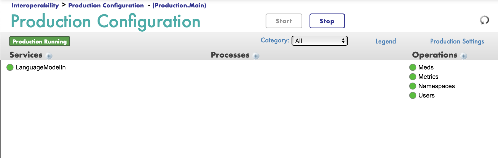
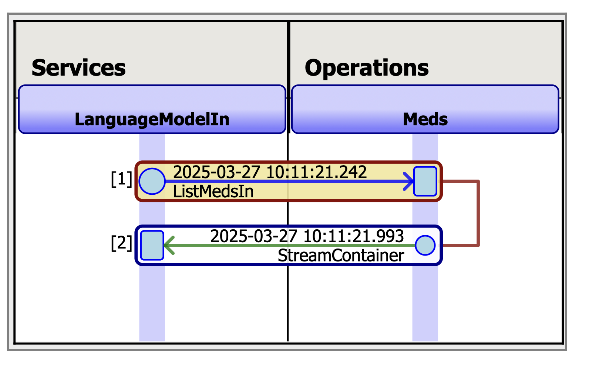
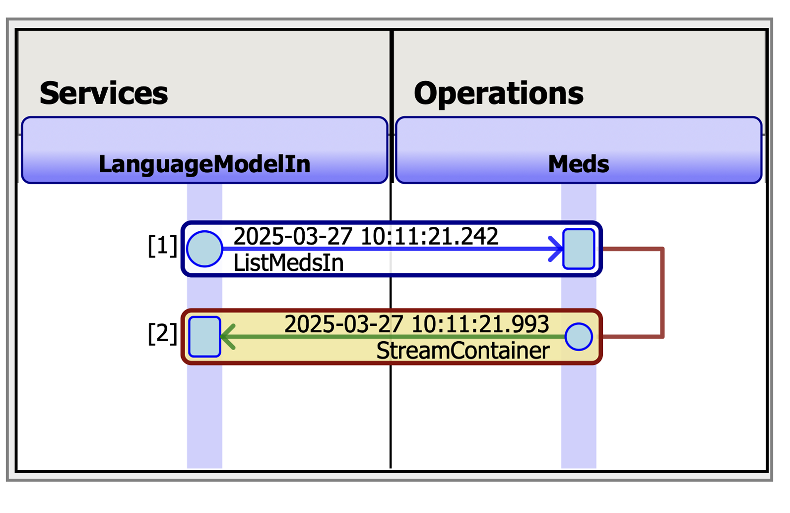
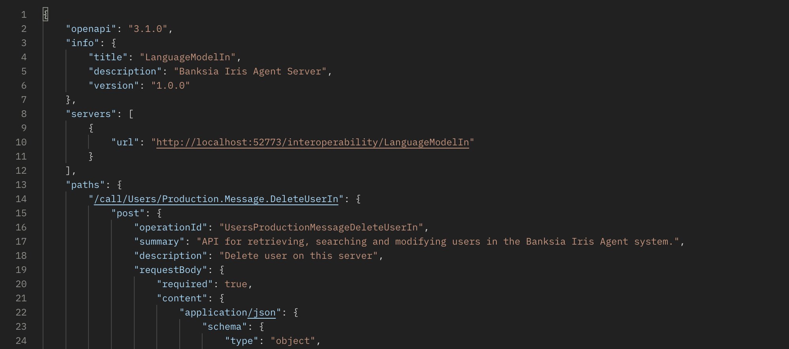
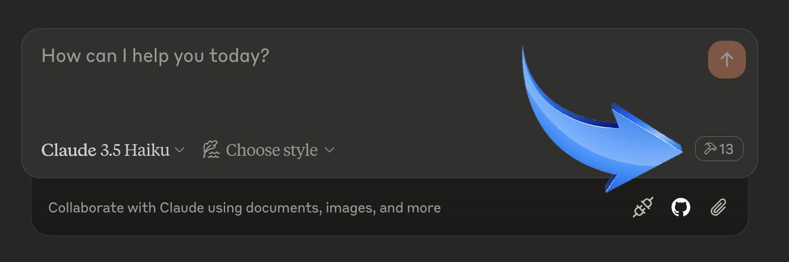
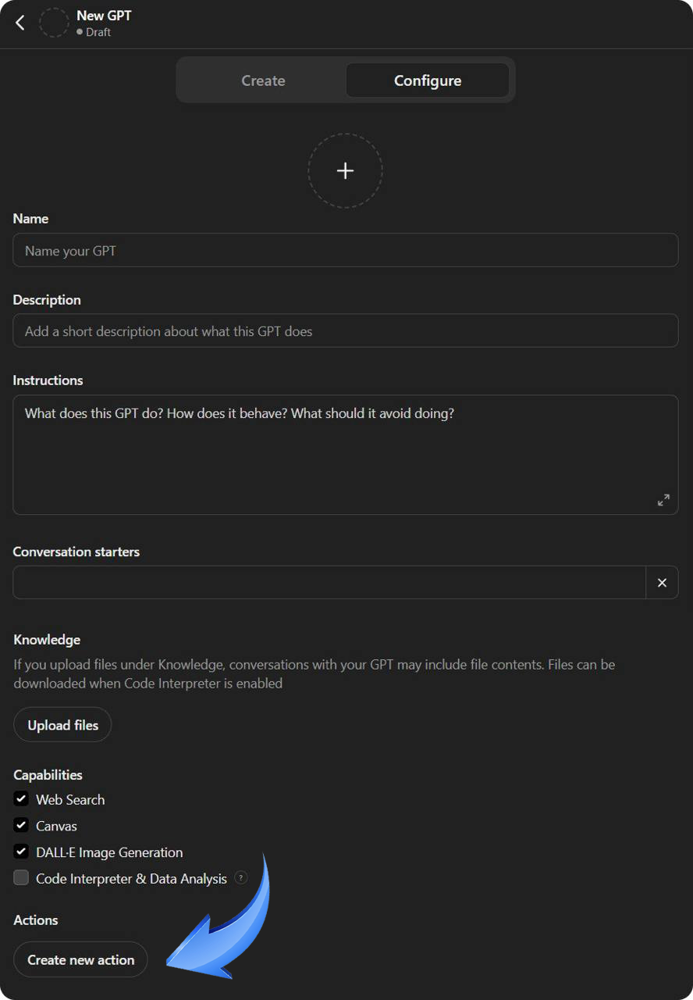
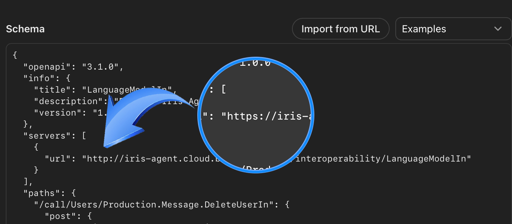
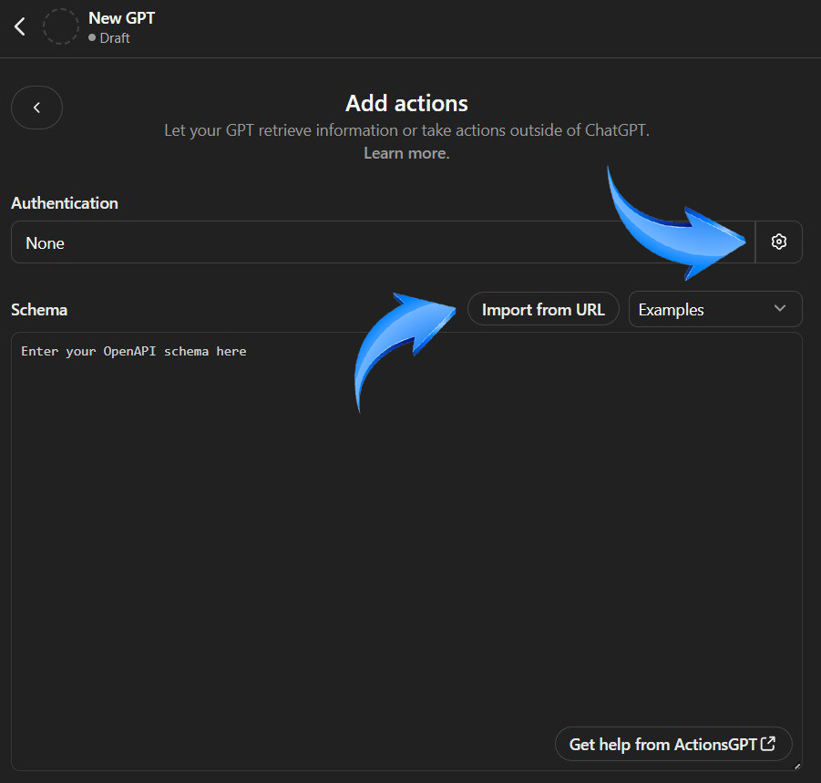
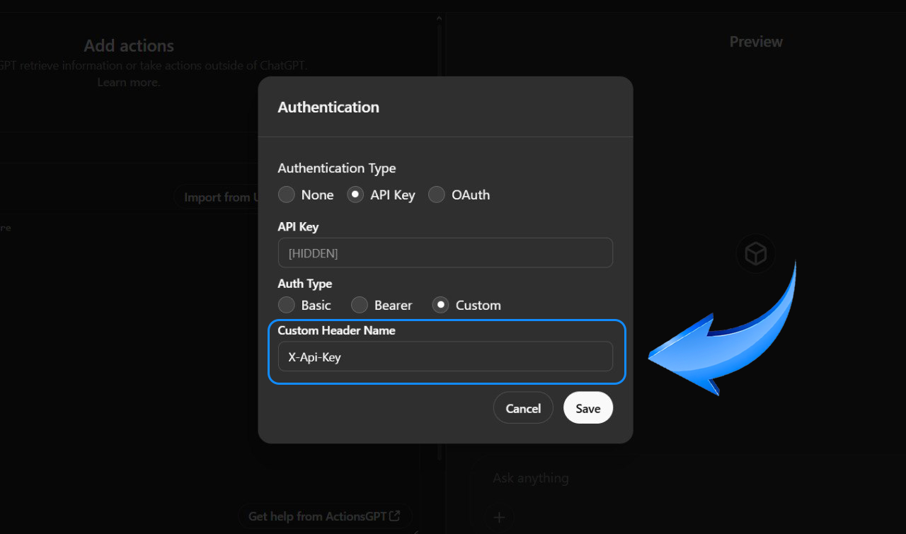
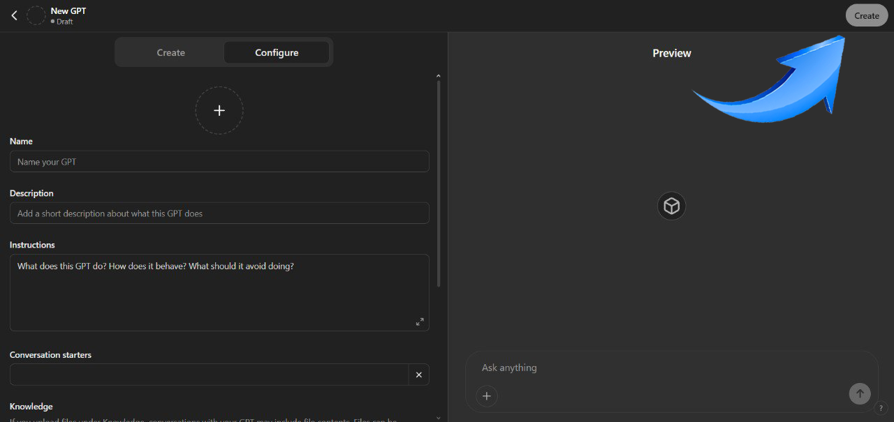

## Summary

The IRIS Agent project is an example of how generative AI and automated data retrieval can be integrated into applications developed with InterSystems technologies. The developed application is designed to interact with the Management Portal Iris, assisting users in retrieving system data and modifying non-critical settings.

### Technologies Used

- InterSystems IRIS: A platform for application development and data integration, utilizing ObjectScript for server-side solutions.

- Custom GPT Bot: A customized GPT-based bot designed for specific tasks.

- Claude AI Desktop: Used to interact with the server via the Model Context Protocol (MCP).

- Node.js: Platform for running and managing MCP servers.

- OpenAPI: A standard for describing and interacting with APIs.

- Docker: Used for containerizing the application, simplifying deployment and managing dependencies.

## Features
 - Getting, searching, creating and deleting users on server;
 - Searching and changing namespaces on server;
 - Getting and searching applications available on server; 
 - Getting and searching errors available on server;
 - Getting and searcing logs available on server
 - Getting and searching all roles available on server;
 - Getting and searching all services available on server;
 - Getting and searching all system profiles available on server;
 - Searching of medicine on the external API; 

## How to Run

- You should clone this repo:

```
git clone https://github.com/banksiaglobal/bg-iris-agent
```

- Install Docker Desktop if not installed via link:
```
https://www.docker.com/products/docker-desktop/
```

- Run the Docker Desktop. Open a terminal in this directory and run:
```
docker-compose up -d
```
Now you can open the management portal page by following the
 [Production link](http://localhost:52773/csp/user/EnsPortal.ProductionConfig.zen?$NAMESPACE=USER&$NAMESPACE=USER&)

- **User**: ``_SYSTEM``
- **Password**: ``SYS``



The Production consist of the following elements:

- LanguageModelIn - service that receives an api request and redirects it to work on the responsible operation.
- Meds - operation that searches for medications on a third-party api.
- Metrics - operation that receives and searches for metrics information such as logs, errors, messages in the Banksia Iris Agent system.
- Namespaces - operation that receives, searches and modifying namespaces in the Banksia Iris Agent system.
- Users - operation that receives, searches, create and delete users in the Banksia Iris Agent system.

The functioning of the system can be seen most clearly in the visual traces. There is a visual trace of receiving the request and generating a response when searching for medicine:




You can get acquainted with the open API scheme by following
the link:
```
http://localhost:52773/interoperability/LanguageModelIn/
openapi
```


Generate an API key to securely connect your portal to AI
tools:
```
http://localhost:52773/interoperability/LanguageModelIn/
createapikey
```
After generating the key, it will automatically be available
for connection to the Claude AI.


# Video

[BG-Iris-Agent](тут будет актуальная ссылка)

# **1. Run locally with Claude AI Desktop**
## How to Run
- **Install Node.js if not installed via link:**
```
https://nodejs.org/en
```
- Navigate to the mcp-nodejs-server folder from the root project directory
```
cd mcp-nodejs-server
```
- **Install Node.js modules if not installed via terminal:**
```
npm install node-fetch @modelcontextprotocol/sdk zod --savedev @types/node
```
- **Install Claude for Desktop if not installed via link:**
```
https://claude.ai/download
```
- **Run the command via terminal from the folder mcp-nodejs-server:**
```
node build/index.js
```
- Register or log in to your Claude account (both paid and
free subscriptions are suitable)
- Make sure your docker is running and the project is running locally
- Make sure you have generated the api key via the link:
```
http://localhost:52773/interoperability/LanguageModelIn/createapikey
```
- Сonfigure Claude for Desktop for MCP server. Open your Claude for Desktop App configuration at ~/Library/
Application Support/Claude/claude_desktop_config.json in a text editor. Make sure to create the file if it doesn’t exist. You could find and open the file via Claude Desktop -> Settings -> Develop -> Edit config

You can also open the file via terminal. For example, if you have VS Code installed:
> **MacOS/Linux**
```
code ~/Library/Application\ Support/Claude/
claude_desktop_config.json
```
> **Windows**
```
code $env:AppData\Claude\claude_desktop_config.json
```
Add server configuration. Use this example to fill 
the claude_desktop_config.json file you opened before:

```
{
    "mcpServers": {
        "bg-iris-agent": {
            "command": "node",
            "args": [
                "<your_local_path_to_the_file_on_your_computer>/bg-iris-agent/mcp-nodejs-server/build/index.js"
            ],
            "env": {
                "API_KEY": "YourApiKey"
            }
        }
    }
}
```
Specify the path to the file index.js on your computer and your api key you've generated before (after generation copy your key from the management portal of your local project: System Explorer -> Globals -> find your api key via SecretApiKey name). Save the
claude_desktop_config.json file you just filled,
and restart Claude for Desktop.
You could see if Claude for Desktop picked up the tools by
clicking on the hammer icon.



**If the hammer icon has shown up, you can now test your
server via Claude for Desktop chat.**


# **2. Run remotely with Custom GPT Bot** (for GPT Plus and upper)

### **Make sure your project is running on a remote server (not locally)**

- Open [ChatGPT Custom GPT](https://chat.openai.com/) and create a new bot.

- In the **"Configure"** section, scroll down to **"Actions"** and pick **"Create new action"**.



- Next click **"Import from URL"** and fill using this link:

  ```
  https://<YOUR_REMOTE_HOST>/interoperability/LanguageModelIn/openapi
  ```
- Check that servers have an address via https protocol. If not, correct http to https.



Then go to **"Authentication"** section.



- To set **"Authentication"** options you need to follow this link, to create your own Api key:

  ```
  https://<YOUR_REMOTE_HOST>/interoperability/LanguageModelIn/createapikey
  ```
- Copy your key from the management portal of your remote project - System Explorer -> Globals -> find your api key via SecretApiKey name
- Enter your Api key in **Authentication form** in the Api Key field. Use Custom Header Name X-Api-Key like on screenshot.



- Do not forget to **Save/Update** your changes.




## Developers of Project

- [Georgii Tatevosian](https://community.intersystems.com/user/georgii-tatevosian): Backend Developer
- [Elena Karpova](https://community.intersystems.com/user/elena-karpova): Backend Developer
- [Alena Kras](https://community.intersystems.com/user/alena-krasinskiene): Quality Engineer

We are the team of Banksia Global company and we always are opened for something new and interesting!

\#BanksiaGlobal #AITools #GenerativeAI #AI #ObjectScript #InterSystems 